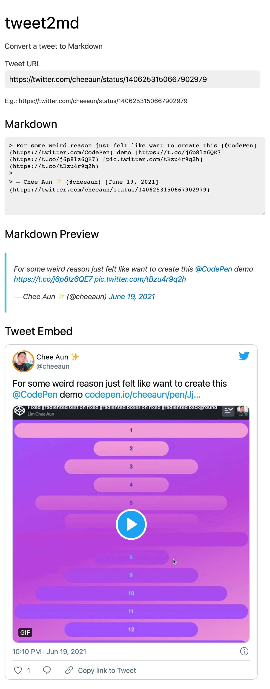

tweet2md
===

> Convert a tweet to Markdown

This web app converts a tweet (URL) into Markdown. It gets the output from [Twitter Publish](https://publish.twitter.com/) and convert the HTML to Markdown.

This is great for presenting tweets in semantic Markdown format without any embed JavaScript code and `iframe`.

Screenshot
---

